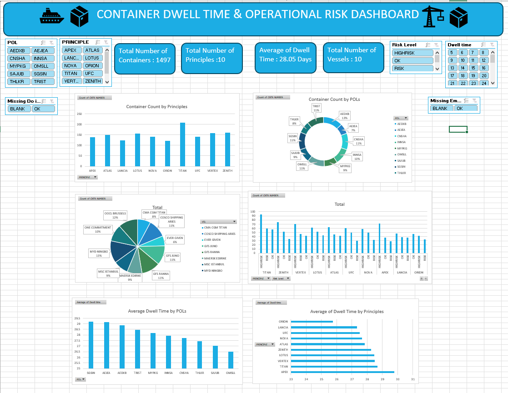

# Container Dwell Time & Operational Risk Dashboard

An interactive Excel dashboard analyzing 1,500 container shipments to identify 
dwell time patterns, flag operational risk, and surface data quality issues — 
built from a deliberately messy, realistic dataset.

## Problem
Containers that sit too long between discharge and export can trigger demurrage 
and detention charges. This dashboard identifies which shipments, principals, 
ports, and vessels carry the highest dwell-time risk, while also tracking data 
completeness so gaps in the source data don't get silently baked into the analysis.

## Dataset
1,500 containers across 10 shipping principals, 10 vessels, and 10 ports of 
loading, over a ~4.5-month period. The dataset was intentionally built with 
realistic data quality issues:
- ~100 rows with missing "Received from Consignee" dates
- ~29 rows with missing "DO Issued" dates
- ~60 container numbers with leading/trailing spaces
- ~40 rows with inconsistent text casing (e.g. port codes)
- A small number of duplicate rows

## Key Findings
- Average dwell time across all containers: **28.05 days**
- Data completeness: ~93% of records had complete date fields; missing 
  "Received from Consignee" and "DO Issued" dates were flagged rather than 
  guessed at or silently excluded
- Risk distribution varies by principal and port of loading — visible through 
  the Risk Level and Dwell Time slicers
- Cleaning matters as much as analysis: fixing spacing and casing 
  inconsistencies was a prerequisite for accurate counts and groupings

## What it does
- Cleans raw data: TRIM on container numbers, standardized text casing
- Calculates dwell time at each stage (discharge → DO issuance → export)
- Flags missing dates via dedicated "Data Status" columns and slicers, instead 
  of excluding or estimating them
- Classifies each container by Risk Level based on total transit time
- Interactive slicers to filter by Principal, POL, Vessel, Risk Level, Dwell 
  Time range, and data completeness (missing DO / missing RCVD)
- Visual breakdown by port, principal, and risk level via PivotCharts

## Tools & Skills
Excel: PivotTables, PivotCharts, Slicers, Report Connections, Conditional 
Formatting, Data Cleaning (TRIM, blank/duplicate handling), SUMPRODUCT, 
COUNTIFS, COUNTBLANK

## Screenshot

## How to use
1. Download the .xlsx file
2. Open in Excel (slicers require Excel 2013+)
3. Use the slicers on the Dashboard sheet to filter by Principal, Vessel, POL, 
   Risk Level, Dwell Time, or data completeness status# Container_Dwell_Time-Operational_Risk_Dashboard
